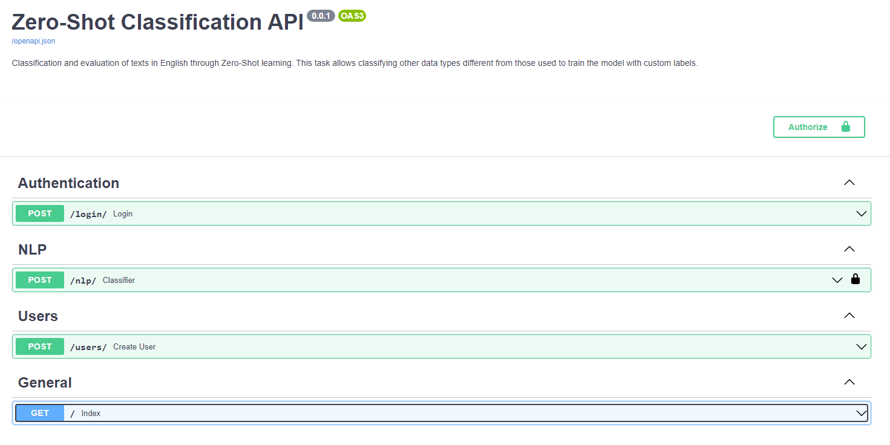
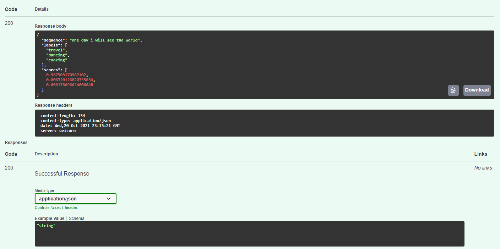

# FastAPI

Production-Ready Machine Learning NLP API built with FastAPI & Mongoengine with a layer of security using OAuth2PasswordBearer.




## Getting Started

### Prerequisites

- Python 3.9 or higher
- MongoDB
- FastAPI
- Docker

### Project setup

```sh
# Clone the repo
$ git clone https://github.com/igmalta/ml-classification-api

# Move to the project folder
$ cd ml-classification-api
```

### Directory structure
```bash
ai/
├── data.py            - Data processing operations
├── utils.py           - Utility functions
app/
├── api/
    └── nlp.py         - Text classification model
    ├── user.py        - User register function
    core/
    └── auth.py        - Login FastAPI endpoint params
    ├── nlp.py         - Classifier FastAPI endpoint params
    ├── user.py        - User register FastAPI endpoint params
    database/
    └── mongodb.py     - MongoDB configuration
    models/
    └── models.py      - Document models
    schema/
    └── hash.py        - Password encryption
    ├── oa2.py         - User authorization
    ├── schemas.py     - Models schemas
    ├── token.py       - Credentials generation (JWT token)
├── config.py          - Logging configurations
├── main.py            - FastAPI start app
tests/
├── ai/
    └── test_data.py   - Test data processing functions
    ├── test_main.py   - Test preprocessing documents function
    ├── test_utils.py  - Test utils functions
├── app/
    └── test_main.py   - Test app main components
```
## Workflows

### Creating virtual environment (Linux)

- Make sure you have `make` installed
- Create a `virtual environment` for this project

```bash
# Install and activate virtual environment,
# then packages are installed through "Poetry"
make venv
source venv/bin/activate
```
- Alternative using `Miniconda`

   > Install Miniconda (optional)
   > 1. Download the latest shell script
      wget https://repo.anaconda.com/miniconda/Miniconda3-latest-Linux-x86_64.sh
   > 2. Make the miniconda installation script executable
      **chmod +x Miniconda3-latest-Linux-x86_64.sh**
   > 3. Run miniconda installation script
      **./Miniconda3-latest-Linux-x86_64.sh**


```bash
# Install and activate Miniconda virtual environment,
# then packages are installed through "Poetry"
make vconda PYTHON=3.*
conda activate venv
```

### Running the Application

- To run the [Main](main.py) we need to use [uvicorn](https://www.uvicorn.org/) a lightning-fast ASGI server implementation, using uvloop and httptools.
- Also, need to start MongoDB server on the configured port.

```sh
# Running the application using uvicorn
$ uvicorn app.main:app

## To run the Application under a reload enviromment use -- reload
$ uvicorn app.main:app --reload
```

### Environment variables

- `MODEL_PATH`: Directory where models are saved.
- `ZERO_SHOT_MODEL`: Name of the used Transformer model.
- `SECRET_KEY`: A secret key for signing Json Web Token.
- `ACCESS_TOKEN_EXPIRE_MINUTES`: The access token expire minutes.
- `DB_NAME`: Database name to save the user forms.
- `DB_ALIAS`: Database alias to save the user forms.
- `DB_HOST`: Database host connection.
- `DB_PORT`: Database port connection.

> change all the environment variables in the `.env.sample` and don't forget to rename it to `.env`.

### Running Docker Compose

- The docker-compose file builds an image of the FastAPI app and then starts it in an isolated container. In another container, is started a mongo server instance from an official image of the Docker Community.

```bash
# Create and start containers
docker-compose up -d
```

### Testing

- Full coverage testing.

```bash
# Report in STDOUT
python -m pytest --cov tests

# Report in htmlcov
python -m pytest --cov tests --cov-report html
```
